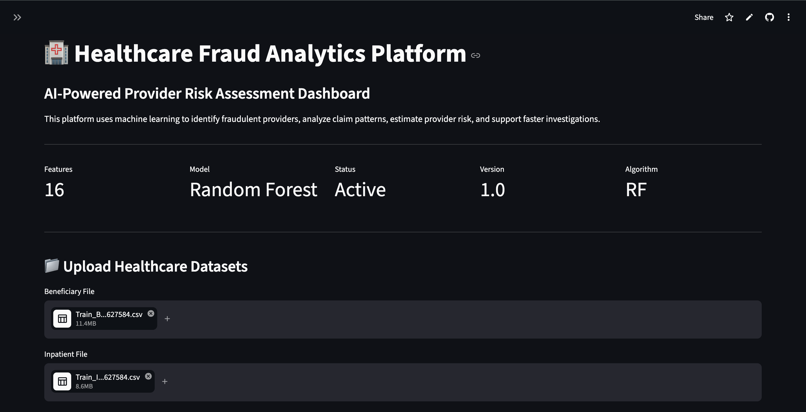
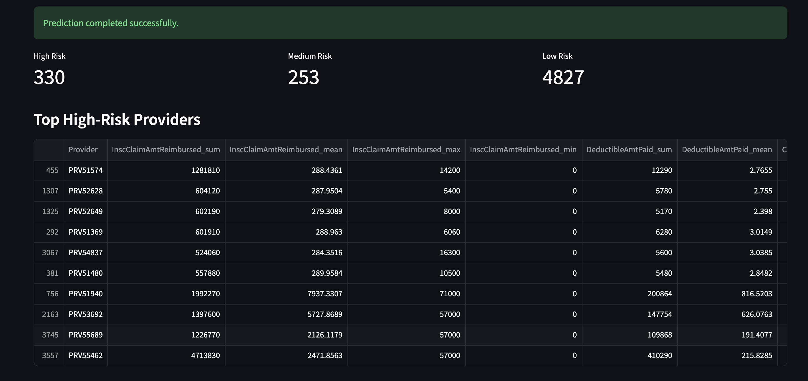
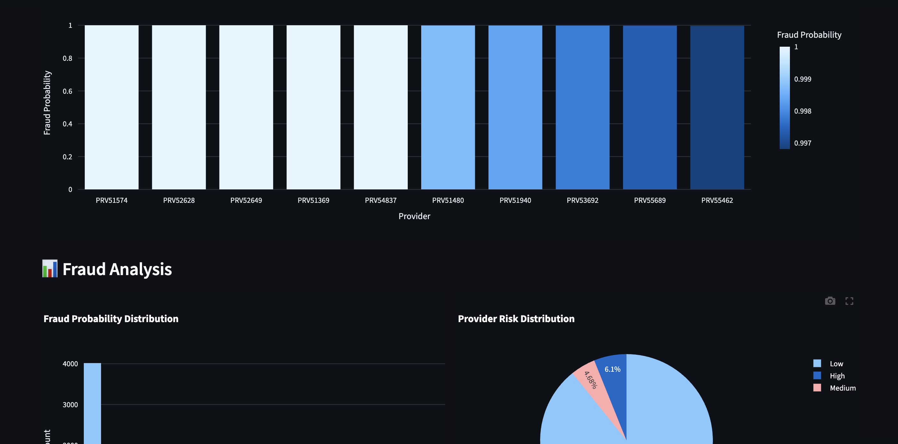

<<<<<<< HEAD
# 🏥 Healthcare Fraud Analytics Platform

An end-to-end machine learning solution for detecting fraudulent healthcare providers by analyzing inpatient, outpatient, and beneficiary claims data.

---

## 🚀 Project Overview

This project uses machine learning techniques to identify potentially fraudulent healthcare providers and assist investigators in reducing financial losses.

The platform includes:

- Data preprocessing
- Feature engineering
- Exploratory data analysis
- Model training
- Fraud prediction
- Risk assessment
- Interactive Streamlit dashboard

---

## 🛠️ Technology Stack

| Category | Technology |
|----------|-------------|
| Language | Python |
| Data Analysis | Pandas, NumPy |
| Machine Learning | Scikit-learn |
| Visualization | Plotly |
| Dashboard | Streamlit |
| Model Storage | Joblib |

---

## 📁 Project Structure

```text
HEALTHCARE-FRAUD-DETECTION/
│
├── app.py
├── requirements.txt
├── README.md
├── .gitignore
│
├── data/
│
├── models/
│   ├── fraud_model.pkl
│   └── fraud_pipeline.pkl
│
├── notebooks/
│   └── Sagility1.ipynb
│
└── src/
    ├── feature_engineering.py
    ├── model.py
    ├── model_input.py
    ├── predict.py
    └── preprocessing.py
```

---

## ⚙️ Installation

Clone the repository:

```bash
git clone <repository_url>
```

Move into the project directory:

```bash
cd HEALTHCARE-FRAUD-DETECTION
```

Install the dependencies:

```bash
pip install -r requirements.txt
```

---

## ▶️ Run the Application

```bash
streamlit run app.py
```

---

## 🤖 Machine Learning Workflow

1. Data collection
2. Data cleaning
3. Feature engineering
4. Data aggregation
5. Model training
6. Model evaluation
7. Fraud prediction
8. Risk classification
9. Dashboard visualization

---

## 📊 Features

- Provider-level fraud detection
- Automated risk scoring
- Interactive visualizations
- Top high-risk provider identification
- Downloadable prediction reports
- Real-time analytics dashboard

---

## 📈 Future Improvements

- Deep learning models
- Real-time fraud detection
- Cloud deployment
- Explainable AI integration
- Advanced anomaly detection

---
## Dashboard Preview

### Home Page



### Fraud Analysis



### High-Risk Providers



---

## 👨‍💻 Author

Appaji Gouda

Artificial Intelligence and Machine Learning Engineer
=======
# Healthcare-Fraud-Detection
An end-to-end machine learning solution for detecting fraudulent healthcare providers by analyzing inpatient,  outpatient, and beneficiary claims data.
>>>>>>> e009b5d31ebe3f361ad927f6f0ab90809b320d75
